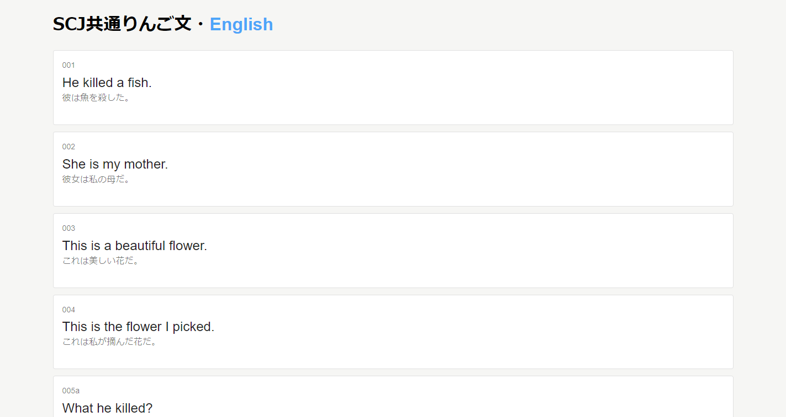

# ringoyaki

ringoyaki（りんご焼き）は、SCJ共通りんご文の翻訳を手軽に表示させることができるツールです。



ringoyakiはSCJ共通りんご文と同じく開発途中です。
ご了承ください。

## 何ができるの？

- りんご文を翻訳したものがブラウザに美しく描画されます。
- 画一されたデザインのため、他の言語と見比べやすいです。
- 編集しながら、出来具合を確認することができます。
- 翻訳されていない部分は描画されないため、未完成でも見やすいです。
- 手軽にそのままの状態でWebページとしてインターネット上に公開することができます。

## 導入方法

簡単です！
以下の手順に従って導入しましょう。

**注意！**
Windowsの方のみの方法しか書かれていません。
私はMacを持っていないので手順を書くことができません。

（Dockerが大好きなあなたへ：Dockerを使うこともできます。以下に方法を書きました。）

### gitのインストール

gitをインストールしていない方は以下の手順に従ってください。

1. Windows PowerShell を起動させます
2. [scoop](https://scoop.sh/)のインストールをします
   1. Windows PowerShellで `Invoke-Expression (New-Object System.Net.WebClient).DownloadString('https://get.scoop.sh')` を実行します。（実行するには、そのコマンドを入力してエンターキーを押します。）
   2. もし、`PowerShell requires an execution policy in [Unrestricted, RemoteSigned, ByPass] to run Scoop.`というようなエラーが出た場合は、`Set-ExecutionPolicy RemoteSigned -scope CurrentUser` を実行してから、もう一度 2.1. のコマンドを実行します。
3. `scoop install git`を実行して`git`をインストールします。
4. `git`を実行してもエラーが発生しなければ成功です！

### node.jsのインストール

node.jsをインストールしていない方は以下の手順に従ってください。
ただし、すでにscoopをインストールした場合は、3.から進めてください。

1. Windows PowerShell を起動させます
2. [scoop](https://scoop.sh/)のインストールをします
   1. Windows PowerShellで `Invoke-Expression (New-Object System.Net.WebClient).DownloadString('https://get.scoop.sh')` を実行します。（実行するには、そのコマンドを入力してエンターキーを押します。）
   2. もし、`PowerShell requires an execution policy in [Unrestricted, RemoteSigned, ByPass] to run Scoop.`というようなエラーが出た場合は、`Set-ExecutionPolicy RemoteSigned -scope CurrentUser` を実行してから、もう一度 2.1. のコマンドを実行します。
3. `scoop install nodejs-lts`を実行してnode.jsをインストールします。
4. `node -v`を実行してもエラーが発生しなければ成功です！

### 導入する

さて、導入してみましょう！

1. りんご文の翻訳作業を行う場所、つまり、このリポジトリをクローンしたいフォルダをエクスプローラーで開いてください。
2. エクスプローラーのファイルやフォルダが何もないところで、Shiftキーを押しながら、右クリックを押してください。
3. すると「PowerShell ウインドウをここで開く(S)」というボタンが現れるのでそれをクリックしてください。
4. 青い画面が現れましたか？
5. `git clone https://github.com/skytomo221/ringoyaki`を実行します。
6. これでリポジトリがクローンされました。
7. 次に`cd ringoyaki`を実行します。
8. `npm install`を実行します。
9. `npm run start`を実行します。
10. ブラウザが開きましたか？成功です！
11. このまま状態で`./src/data/translation.json`をお好みのテキストエディタで開きます。
    1. えっ、テキストエディタがメモ帳しかない？[Visual Studio Code](https://code.visualstudio.com/)をインストールしましょう。
12. translationの項目にある英文をあなたの言語に置き換えて、保存しましょう。
13. もう一度、ブラウザを見てみましょう。更新されていますか？おめでとうございます。これで今日からあなたも立派なりんご文の翻訳者です！
14. 終了したい場合はWindows PowerShellのCtrl+Cを押してください。

### Dockerを使って導入する

上級者向けです。（いまいちDockerに慣れていないので、もし改善できるところがあったらプルリクください♡）

以下の通りにコマンドを打ってください。

```sh
$ git clone https://github.com/skytomo221/ringoyaki
$ cd ringoyaki
$ docker-compose build
$ docker-compose up
```

## Webサイトを公開する

Github Pagesを使って公開することができます。
詳細は後日書きます。
